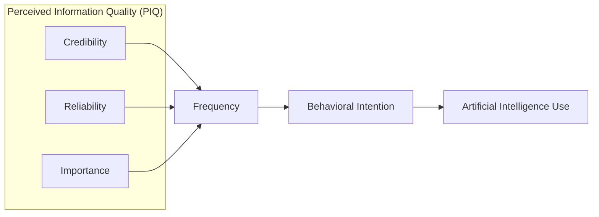
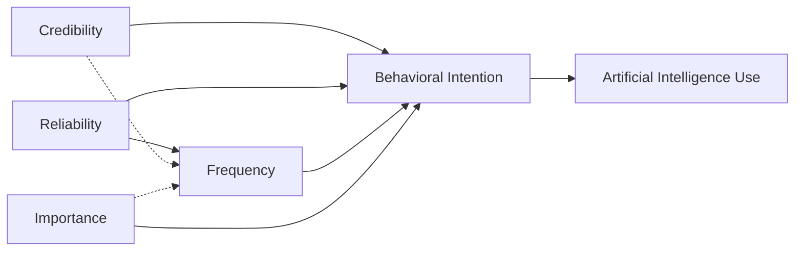

Vol.8 No.2 (2025)

**JALT** Journal of Applied Learning & Teaching

**ISSN : 2591-801X**

Content Available at : http://journals.sfu.ca/jalt/index.php/jalt/index

# Evaluating the impact of perceived information quality on GenAI technology adoption in higher education students

Aniekan E. EssienA

Joseph CrawfordB

Marios D. KremantzisC

**A** Assistant Professor, University of Bristol, United Kingdom

**B** Associate Professor, University of Tasmania, Australia

**C** Senior Lecturer, University of Bristol, United Kingdom

## Keywords

AI adoption;
Generative AI;
Higher Education;
perceived information quality;
student engagement.

## Correspondence

marios.kremantzis@bristol.ac.uk B

## Article Info

Received 25 January 2025
Received in revised form 18 May 2025
Accepted 21 May 2025
Available online 7 July 2025

**DOI:** https://doi.org/10.37074/jalt.2025.8.2.5

## Abstract

This study investigates the significant influence of perceived information quality (PIQ) on students' engagement with AI technologies in higher education. Employing structural equation modelling (SEM), we analysed responses from 522 university students to understand how the perceived quality, reliability, and relevance of AI-related information affect their intent and actual usage of generative AI (GenAI). The results reveal that PIQ directly boosts students' readiness to adopt GenAI, with information frequency serving as a mediator that enhances perceived importance and credibility, thus fostering trust. Additionally, our results show that students who regularly interact with high-quality AI information are more likely to use GenAI tools. However, the presence of information overload can negatively impact actual usage despite high intent to use. These insights offer valuable guidance for educators, policymakers, and tech developers aiming to promote effective adoption of AI tools, thereby improving learning outcomes and student engagement in the digital age.

Journal of Applied Learning & Teaching Vol.8 No.2 (2025)                1

---

## Introduction

Recent data indicate that 62% of students interact with GenAI tools (e.g., ChatGPT and Microsoft Copilot) in their academic activities, reflecting a significant rise from earlier levels (Microsoft, 2024). The rapid advancement of AI technologies is revolutionising work and learning, with higher education (HE) being no exception (Bearman et al., 2023; Mills et al., 2023). Some scholars liken the insurgence of GenAI to the invention of the calculator, and others offer the disruption Gutenberg's printing press caused to universities as a comparator, though GenAI extends far beyond this (Lodge et al., 2023). Students can now seek immediate referencing and research support from a well-programmed chatbot, or companionship with a social companion bot while completing their late-night assignments; with benefits and perils for both (Crawford et al., 2024). The increasing integration of GenAI tools in academic settings presents two potential avenues of application: (1) students using them autonomously to augment their learning experiences and (2) educator-driven integration to enhance pedagogical outcomes. This study distinctly focuses on the perspective of autonomous use of GenAI by students, which involves students independently employing these tools to support and enhance their learning processes. This approach is differentiated from how educators might integrate these tools into the curriculum, which often aligns with specific instructional strategies and learning goals.

## Autonomous GenAI usage by students

Autonomous GenAI adoption by students primarily facilitates direct interaction with AI tools, enabling personalised learning enhancements such as immediate referencing, research support, and even companionship during late-night study sessions. In fact, these tools are becoming integral to how students meet their educational needs, fostering both engagement and academic performance. As such, there is an increase in the discourse on their use and misuse (Crawford et al., 2024; Ivanov et al., 2024). ChatGPT, for instance, is gaining popularity in education by supporting personalised learning experiences and innovative teaching methods (Nguyen et al., 2024; Bin-Nashwan et al., 2023; Rudolph et al., 2023; Rasul et al., 2023). Nicknamed 'Chatty G' in some Australian classrooms, this tool can enhance learning if properly adopted and integrated with effective pedagogical strategies.

Understanding what drives students to adopt GenAI autonomously is crucial for several reasons. First, the successful integration of GenAI in education can improve learning outcomes by delivering tailored content and support, boosting student engagement and performance (Nguyen et al., 2024; Bearman et al., 2023). Second, such insights can help educators and policymakers to develop strategies that promote the adoption of these technologies, ensuring their benefits are fully realised. Lastly, as GenAI continuously evolves, understanding the factors influencing their adoption —such as student characteristics including digital literacy and attitudes towards technology, policy-related factors e.g., privacy and data security concerns, learning environment conditions that facilitate/hinder the use of AI tools, and teacher characteristics including readiness and attitude towards integrating technology— can guide future research and development, guaranteeing these tools are designed to align with students' needs and preferences. Understanding the drivers of autonomous GenAI adoption by students is crucial for several reasons: it directly affects their learning outcomes by providing tailored academic support, boosts engagement and performance, and guides future technological developments to align with students' needs and preferences.

## Theoretical and practical relevance

Technology adoption in education has a well-established nomological network, with key drivers including perceived usefulness, ease of use, and social influence (e.g., Lai et al., 2022). TAM and UTAUT are commonly employed frameworks in studying technology adoption. For GenAI, early adoption predictors from the students' perspective include expected benefits, attitude towards technology, and personal initiative rather than curriculum integration or instructional strategies (Yilmaz et al., 2023). Several studies have expanded these models to include factors, such as perceived trust and convenience, relevant to GenAI technologies in education (Choi et al., 2023). Trust in technology, such as GenAI, significantly shapes students' interactions with and adoption of emerging technologies (Wang et al., 2024). For GenAI, trust is essential. Students base their decisions on the trustworthiness of the technology and the accuracy and relevance of the information it provides, despite potential limitations in the data from these systems. High-quality information about the technology can enhance perceived reliability and usefulness (Choi et al., 2023).

In this context, PIQ is a strong theoretical lens for explaining the adoption of GenAI tools from a student perspective. PIQ is a well-established concept in technology acceptance/ adoption literature, defined as the extent to which information is perceived as accurate, relevant, and trustworthy by its recipients (Bailey & Pearson, 1983). While its significance has been extensively validated in domains such as healthcare (Jiang et al., 2021), marketing, and information systems (Wu et al., 2021), PIQ remains underdeveloped in educational research, particularly in GenAI adoption. It is critical to distinguish between the information generated by AI tools, which students evaluate for quality and trust, and the instructional information about these tools, which educators must design and convey effectively. This distinction is important as the quality of information students receive about AI tools can significantly shape their perceptions and intentions to use them. We argue that while PIQ in this context would involve assessing the quality of information generated by GenAI tools, it is crucial to recognise that these perceptions can be influenced by the inherent limitations of the tools themselves, including the potential to deliver outdated or inaccurate outputs regardless of the quality of input prompts. This factor is critical as it impacts the perceived accuracy, relevance, and trustworthiness of the information provided by GenAI systems, thus affecting PIQ and the overall adoption of these technologies.

Journal of Applied Learning & Teaching Vol.8 No.2 (2025)                                             2

---

Empirical evidence from other fields —including healthcare (Jiang et al., 2021), e-commerce (Kim et al., 2019), online banking (Rahman et al., 2021), and government digital services (Aini et al., 2024)— suggests that high-quality information enhances trust by providing accurate, relevant, and transparent details, thereby increasing users' perceived value of the technology and their likelihood of adopting it (e.g., Wang & Zhao, 2023). Given the uniqueness of GenAI, where the quality of output is directly influenced by the quality of input prompts (Essien et al., 2024), it is important to consider how PIQ affects technology adoption in educational settings. This study aims to explore the role of PIQ in shaping students' intentions to autonomously adopt GenAI technologies and their actual usage, emphasising how the quality of information about GenAI tools influences their behavioural intentions and engagement frequency. Specifically, it examines how the perceived quality of information about GenAI tools influences students' behavioural intentions and the frequency with which they engage with it. We address a crucial gap in understanding the role of information quality in technology adoption (Behl et al., 2024), offering significant theoretical and practical implications. Theoretically, our study expands existing technology adoption models by integrating PIQ as a key determinant. Practically, it provides actionable insights for educators, policymakers, and GenAI technology developers by effectively communicating the benefits and capabilities of GenAI tools to students, thus enhancing adoption and usage. Our study focuses specifically on the autonomous use of GenAI by students to support their learning processes, distinguishing it from educators' integration of these tools into pedagogical strategies.

The contributions of our study are two-fold. First, we provide empirical evidence about the direct impact of PIQ on students' intentions to adopt GenAI technologies. By demonstrating that high-quality information significantly shapes these intentions, we emphasise the importance of information quality in promoting GenAI adoption. While our study highlights the ethical implications of disseminating high-quality information, it does not specifically provide strategies for ethical use. Instead, it identifies the critical role of accurate and trustworthy information in fostering responsible adoption practices. Second, our investigation into the mediating role of information frequency highlights how consistent, credible information further strengthens students' intentions, highlighting the need for ongoing, high-quality communication to maintain student engagement with GenAI technologies. Additionally, we address the risks of overcommunication, including information overload and cognitive fatigue, which can diminish effectiveness and ultimately lead to disengagement. Finally, we enhance the understanding of GenAI adoption in HE by presenting a comprehensive framework that integrates PIQ into existing technology adoption models, providing deeper insights into the factors influencing GenAI adoption in HE.

## Literature review

### Artificial intelligence and GenAI

There is growing interest in integrating AI into HE, driven by the rise of GenAI technologies (Nguyen et al., 2024; Sætra, 2023). These innovations offer both opportunities and challenges in reshaping education. GenAI can enhance personalised learning by offering tailored support in brainstorming, writing, and research, fostering a more individualised learning experience (Wang et al., 2024). Additionally, GenAI's capacity to generate complex content and simulate real-world scenarios benefits both language learning and technical education (Chiu, 2024). This transition from content creation to knowledge curation improves education quality and creates more engaging learning experiences.

However, integrating GenAI in HE also poses challenges. Issues surrounding academic integrity, accuracy, and ethical use are significant concerns (Crawford et al., 2024). The difficulty in detecting AI-generated content may lead to false accusations, potentially undermining academic integrity (Perkins et al., 2024). Moreover, there is evidence suggesting that while GenAI enhances understanding and application, it may hinder the development of critical thinking skills (Essien et al., 2024). In response, some scholars advocate for assessment disclosure scales to promote transparency between students and teachers, though these initiatives are still in their infancy (Rudolph et al. 2024; Perkins et al., 2024).

GenAI can also support international students by providing language assistance and improving accessibility. It can level the playing field for non-native English speakers by offering real-time language support and feedback, enhancing their academic experience (Zhai & Wibowo, 2023). However, over-reliance on GenAI may reduce human interaction and increase loneliness among students (Crawford et al., 2024). To address these challenges, Zhou et al. (2024) emphasise the importance of balancing AI integration with human elements to sustain student engagement and emotional well-being. To effectively integrate GenAI in HE, institutions must focus on developing GenAI literacy among students and educators, showcasing the capabilities, limitations, ethical use, and critical evaluation of AI-generated content. Additionally, there are calls for future research on innovative pedagogies and assessment methods that leverage AI while preserving academic integrity (Chiu, 2024; Perkins et al., 2024).

### Theories of technology use

Technology adoption in education can be explained using various theoretical frameworks, such as the Technology Acceptance Model (TAM) (Davis, 1989). TAM suggests that perceived usefulness and ease of use are key factors that drive technology adoption. Building on these principles, this model has been widely applied in educational contexts, including understanding the use of technology in teaching (Scherer et al., 2019), social media for education, and adoption from a behavioural perspective (Wang & Zhao, 2023; Wang et al., 2024).

Journal of Applied Learning & Teaching Vol.8 No.2 (2025)                                       3

---

The Substitution, Augmentation, Modification, and Redefinition (SAMR) model (Puentedura, 2009) is another framework used to understand technology adoption in HE. It categorises technology use into four levels: substitution, augmentation, modification, and redefinition, assisting educators in evaluating the stages of technology integration and its potential for transformative change. In the context of AI adoption, the SAMR model has been applied to assess how AI can replace traditional methods, enhance learning experiences, modify teaching practices, and redefine educational paradigms. Halverson et al. (2023) also used the SAMR model to explore how perceived convenience and improved performance influence learning, emphasising these factors in driving technology adoption.

The SAMR model is relevant to this study as it provides a structured lens to evaluate how students' autonomous use of GenAI progresses from basic substitution of traditional academic tasks (e.g., using GenAI for summarising texts instead of manual notes) to more transformative uses that redefine their learning practices (e.g., leveraging GenAI to co-create content or generate novel research insights). SAMR highlights a structured approach to how perceived information quality influences initial acceptance by mapping students' adoption behaviours across these stages, supporting deeper, more innovative engagements with GenAI technologies over time.

## Perceived information quality (PIQ), trust and technology use

PIQ is a multidimensional construct encompassing the perceived accuracy, relevance, timeliness, and trustworthiness of information (Bailey & Pearson, 1983). In the context of GenAI adoption, it refers to the quality of information provided by the tools themselves, as well as the information about their capabilities, limitations, and ethical considerations. High-quality information builds user trust and positively influences perceived usefulness and ease of use, foundational components of technology acceptance models (Davis, 1989; Venkatesh et al., 2003).

The role of PIQ in shaping technology adoption is well-documented across various domains, such as healthcare and e-learning (Jiang et al., 2021; Wu et al., 2021). For GenAI, PIQ takes on added significance due to the bidirectional relationship between input and output quality. Accurate, relevant, and trustworthy information enhances users' ability to craft effective prompts and interpret outputs, fostering a sense of control and reliability. Furthermore, clear and accessible information about the tools' capabilities and limitations can mitigate user apprehension and increase adoption likelihood (Choi et al., 2023).

Despite its importance, PIQ is often underdeveloped in educational research. While existing studies highlight its influence on user engagement and trust (Lee et al., 2024), they seldom address its role in GenAI adoption. This oversight is significant, as the unique operational dynamics of GenAI require a more granular understanding of how information quality impacts adoption decisions. For instance, does PIQ primarily affect trust in the tools' outputs, or does it also influence perceptions of their utility and relevance?

Additionally, PIQ must be clearly defined and contextualised. For this study, PIQ refers not only to the information generated by GenAI tools but also to the metadata about the tools themselves (their design, limitations, and ethical implications). This distinction is crucial for understanding how information quality influences trust and technology use. High-quality metadata, for example, can address student concerns about ethical use and potential harms, thereby promoting responsible adoption.

By integrating PIQ into established technology adoption frameworks, this research advances our understanding of the factors influencing GenAI adoption in HE. It also provides actionable recommendations for improving information delivery, ensuring that students receive accurate, relevant, and trustworthy information about GenAI tools. These insights are essential for balancing the benefits and risks of GenAI in educational settings, fostering trust, and promoting ethical and effective integration.

## Proposed model

Guided by the identified opportunities in the literature, our study seeks to explore the role of PIQ in the adoption of GenAI technology in HE. Our research is driven by the question: *How does the perceived information quality model affect students' intentions and actual use of AI technologies in HE?*

In refining our study theoretical framework, we propose a model that integrates elements of PIQ—credibility, reliability, and importance—directly influencing the frequency of student interactions with GenAI technologies, subsequently affecting their behavioural intentions and actual usage in HE (see Figure 1). This approach redefines the traditional constructs of perceived ease of use and usefulness from the Technology Acceptance Model (TAM) by focusing on PIQ dimensions that are particularly relevant to GenAI technologies.

Figure 1: Proposed research model.

Figure 1 posits that more frequent interactions with credible, reliable, and important information about GenAI enhance students' willingness to adopt such technologies and lead to more consistent and practical usage. Our approach redefines the traditional constructs of perceived ease of

Journal of Applied Learning & Teaching Vol.8 No.2 (2025)                                                           4

---

use and usefulness in TAM and UTAUT by focusing on information quality dimensions specifically relevant to GenAI technologies. Existing studies suggest that, in the context of advanced technologies (e.g., GenAI), traditional ease of use and perceived usefulness may not sufficiently capture the factors influencing adoption without considering the quality of information that shapes these perceptions. Recent studies (e.g., Wang et al., 2024) emphasise the evolving nature of technology acceptance models in digital environments, where information quality is a critical predictor of technology adoption, sometimes overshadowing ease of use and usefulness, especially in emerging technologies, such as AI. Additionally, Habibi et al. (2023) argue that as technologies advance, the quality of information about the technology—its accuracy, timeliness, and relevance—becomes crucial in influencing users' adoption decisions. We argue that by focusing on these specific dimensions of PIQ, our model can more accurately reflect the factors that drive the adoption of GenAI in HE settings.

Furthermore, the integration of PIQ into TAM is justified by its potential to address specific user concerns that directly influence technology acceptance. For instance, credibility, reliability, and importance are essential in shaping students' trust and perceived value of GenAI tools, which are decisive factors for technology adoption in educational settings. The modification of TAM to include these PIQ dimensions aims to provide a more comprehensive understanding of how quality information shapes student engagement and adoption processes in the context of GenAI. The validity of our modified TAM approach is supported by its alignment with the broader theoretical discourse that emphasises the importance of context-specific adaptations in technology acceptance models. This alignment ensures that our model both adheres to established theoretical foundations and resonates with the practical realities of GenAI adoption in education (Wang et al., 2024; Venkatesh & Bala, 2008).

## Methodology

The study adopted a quantitative research design to allow for systematically measuring and analysing relationships between PIQ, behavioural intentions, and actual use of GenAI technologies among higher education students. This approach is well-suited to the research aim of testing hypothesised pathways using established theoretical constructs within a large, diverse sample. Structural equation modelling was selected as the primary analytical technique because it enables simultaneous testing of measurement and structural models, providing a robust framework to examine the direct and mediated effects hypothesised in this study (Hair et al., 2019). This research received ethics approval from the university's ethics committee, ensuring that all procedures complied with ethical standards and protected the participants' rights and well-being.

### Participants

University students (18 years+) were the target HE student population, which comprises 254 million students globally (UNESCO, 2024). The target sample size was 385 to assure a 95 per cent level of confidence and more than 200 to meet Barrett's (2007) rule of thumb for structural equation modelling. Stratified sampling was used, which is advantageous in enabling specific population sub-group representation, thereby improving the precision of the estimates.

### Procedure

The study employed a quantitative research design, utilising a survey to collect data from students in HE institutions worldwide. The online survey, created using Microsoft Forms, underwent rigorous face and content validity checks. A panel of educational technology experts reviewed the survey items for clarity and relevance, ensuring face validity. Content validity was confirmed using pilot testing with a student group whose feedback led to necessary revisions. The survey was promoted through email campaigns, social media, and university bulletin boards over four weeks to reach a diverse, representative sample. Ethical approval was granted by the University of [Withheld for Review] ethics board (Ethics ID:), ensuring all procedures adhered to ethical guidelines for research involving human participants.

### Measures

#### Demographics

Demographics of gender, education discipline being studied, and education level were captured in single-item questions for each.

#### Perceived Information Quality

PIQ was measured using a composite measure developed to ask for credibility, frequency, reliability, and importance, drawing on existing theoretical models of PIQ (Bailey & Pearson, 1983). Participants rated items such as the perceived trustworthiness and relevance of different information sources on a scale from 1 (not credible) to 5 (strongly credible). As PIQ is a composite measure, we tested the items using principal components exploratory factor analysis and identified that all items loaded onto a single primary dimension (between .67-.83) with an eigen-factor of 13.68 and 59.48 per cent variance explained. Two other factors did exceed the 1.0 eigen-factor rule of thumb (1.897, 1.140), but in a scree plot review, only the first factor was retained (Cronbach's α = .97). In the maximum likelihood confirmatory factor analysis, similar results were observed (χ2 = 2.365, df = 1, χ2/df = 2.365, p = .124; TLI = .99, CFI = .99, RMSEA = .05; SRMR = .006).

#### Behavioural Intentions to Use, and Actual Use of AI

We used TAM (Davis, 1989) literature as guidance to develop an item that related to behavioural intentions, namely "I intend to use AI technologies like ChatGPT for my educational needs", rated on a scale between 1 (strongly disagree) and 5 (strongly agree). For the actual use of AI, we used the item "In the past month, how frequently have you used AI technologies (e.g., Chatbots, ChatGPT, Perplexity AI, etc.) for your educational needs?" with response options ranging from 1 (never) to 5 (daily). This adjustment aims to provide a more direct assessment of actual usage patterns, aligning more closely with the objectives of the current

Journal of Applied Learning & Teaching Vol.8 No.2 (2025)                                             5

---

study to explore the impact of PIQ on real-world technology engagement.

## Data analysis

The survey data underwent a two-step analysis process. First, exploratory factor analysis (EFA) and confirmatory factor analysis (CFA) were performed to validate the survey constructs. Factor analysis helped identify the data underlying structure, ensuring accurate construct representation (Fabrigar & Wegener, 2012). For the main analysis, Maximum Likelihood Structural Equation Modelling (SEM) was used, selected for its ability to handle complex models with multiple constructs and indicators. This approach is particularly effective for managing non-normal data distributions, often encountered in survey research, and was suitable for the expected response size of just over 385 participants.

## Results

### Sample

A stratified random sampling method was employed to ensure representation across different faculties, levels of study, and prior exposure to AI technologies, recruiting a total of 522 respondents (see Table 1). There was a generally balanced gender distribution (266 males: 51.5%; 243 women: 47.1%; 7 undisclosed/other: 1.4%). Most of the participants were undergraduate students (63.5%), with a few postgraduate students (22.9%), doctoral students (7.7%), and undisclosed/ other (5.9%). The respondents represented diverse academic disciplines, with Business and Management being the most common (21.7%), followed by Engineering and Technology (18.1%), Health and Medicine (13.8%), and Social Sciences (13.3%). Regarding the current use of AI technologies, most respondents classified themselves as having intermediate experience (46.3%), followed by beginners and advanced users, both at 21.5% and a small portion with no experience (10.6%).

### Model specification

As shown in Figure 2, the structural model assessment showed reasonably strong fit indices (χ2 = .77, df = 3, χ2/df = .257, p = .857; Tucker-Lewis Index (TLI) = .99, Comparative Fit Index = .99, Root Mean Square Error of Approximation (RMSEA) = .01; Standardised Root Mean Residual (SRMR) = .005). These indices suggest a robust model fit, with all relationships significant (p < .001). The analysis indicates that PIQ has a significant positive effect on student behavioural intentions to use AI technologies (β = .36, p < .001). This implies that when students perceive the information about AI technologies as credible, reliable, and important, they are more likely to exhibit intentions to use these technologies, which later progress into actual use behaviour. The PIQ influences the frequency with which students engage with AI-related content, which in turn enhances their behavioural intentions (β = .35, p < .001).

Table 1: Demographic statistics.

<table>
<thead>
<tr>
<th>Variable</th>
<th>None</th>
<th>Basic</th>
<th>Intermediate</th>
<th>Advanced</th>
<th>Total</th>
</tr>
</thead>
<tbody>
<tr>
<td colspan="6"><strong>Gender</strong></td>
</tr>
<tr>
<td>Man</td>
<td>21 (7.9%)</td>
<td>110 (41.4%)</td>
<td>123 (46.2%)</td>
<td>12 (4.5%)</td>
<td>266</td>
</tr>
<tr>
<td>Woman</td>
<td>19 (9%)</td>
<td>97 (46%)</td>
<td>89 (42.2%)</td>
<td>6 (2.8%)</td>
<td>211</td>
</tr>
<tr>
<td>Other/unspecified</td>
<td>3 (7.3%)</td>
<td>7 (17.1%)</td>
<td>27 (65.9%)</td>
<td>4 (9.7%)</td>
<td>41</td>
</tr>
<tr>
<td colspan="6"><strong>Education Level</strong></td>
</tr>
<tr>
<td>Undergraduate</td>
<td>33 (9.2%)</td>
<td>157 (43.9%)</td>
<td>162 (45.2%)</td>
<td>6 (1.7%)</td>
<td>358</td>
</tr>
<tr>
<td>Postgraduate</td>
<td>6 (4.7%)</td>
<td>47 (37%)</td>
<td>67 (52.8%)</td>
<td>7 (5.5%)</td>
<td>127</td>
</tr>
<tr>
<td>Doctorate</td>
<td>1 (4%)</td>
<td>5 (20%)</td>
<td>11 (44%)</td>
<td>8 (32%)</td>
<td>25</td>
</tr>
<tr>
<td>Other</td>
<td>3 (37.5%)</td>
<td>3 (37.5%)</td>
<td>1 (12.5%)</td>
<td>1 (12.5%)</td>
<td>8</td>
</tr>
<tr>
<td colspan="6"><strong>Academic Discipline</strong></td>
</tr>
<tr>
<td>Business and Management</td>
<td>7 (6%)</td>
<td>52 (45.3%)</td>
<td>56 (48.7%)</td>
<td>0</td>
<td>115</td>
</tr>
<tr>
<td>Health and Medicine</td>
<td>1 (14.3%)</td>
<td>1 (14.3%)</td>
<td>5 (71.4%)</td>
<td>0</td>
<td>7</td>
</tr>
<tr>
<td>Social Sciences</td>
<td>6 (5.7%)</td>
<td>56 (52.8%)</td>
<td>41 (38.7%)</td>
<td>3 (2.8%)</td>
<td>106</td>
</tr>
<tr>
<td>Engineering and Technology</td>
<td>6 (6%)</td>
<td>30 (30%)</td>
<td>58 (58%)</td>
<td>6 (6%)</td>
<td>100</td>
</tr>
<tr>
<td>Law and Humanities</td>
<td>11 (9.8%)</td>
<td>46 (41.1%)</td>
<td>49 (43.8%)</td>
<td>6 (5.3%)</td>
<td>112</td>
</tr>
<tr>
<td>Natural Sciences</td>
<td>9 (12.5%)</td>
<td>26 (36.1%)</td>
<td>31 (43%)</td>
<td>6 (8.4%)</td>
<td>72</td>
</tr>
<tr>
<td>Other</td>
<td>3 (30%)</td>
<td>2 (20%)</td>
<td>5 (50%)</td>
<td>0</td>
<td>10</td>
</tr>
</tbody>
</table>

To calculate the indirect effects within the model, bootstrapping was used with a sample of 2,000, with a .95 bias-corrected confidence level. When considering some of the indirect effects of elements of PIQ on AI use, there were some mediation effects, where behavioural intention mediated the relationship from credibility (.06, p = .004), importance (.04, p = .024), and frequency (.10, p = .001). Frequency also offered a mediation effect on behavioural intentions for credibility (.11, p = .001) and importance (.16, p = .001), although frequency had an insignificant mediation effect between reliability and intentions (.03, p = .001).

Figure 2: Perceived information quality effects on intentions and use.

Journal of Applied Learning & Teaching Vol.8 No.2 (2025)    6

---

In the supplementary analyses, we explored the impact of information overload on behavioural intentions and the actual use of AI technologies. Students were divided into two groups based on their frequency of content access: those experiencing information overload (top 25%) and those not experiencing overload. The analysis revealed significant differences in behavioural intentions and actual use between the two groups. Students experiencing information overload reported higher *behavioural intentions* (M = 4.29, SD = .51) compared to those not experiencing overload (M = 3.52, SD = 1.04); t(519) = -10.48, p < .001, Cohen's d = .85. Similarly, *actual use* of AI technologies was higher among students experiencing overload (M = 2.56, SD = .68) compared to those not experiencing overload (M = 2.40, SD = .72); t(519) = -2.608, p < .001, Cohen's d = .70. These results indicate that while frequent access to high-quality information enhances behavioural intentions, it may also lead to information overload, which has a complex impact on actual use. The findings emphasise the need for balancing information dissemination to maximise positive outcomes without causing overload.

The study identifies content access frequency as a key mediator between PIQ and behavioural intentions. Frequent engagement with high-quality AI-related content strengthens students' intentions to adopt GenAI technologies, consistent with Kim & Kwon (2024), who found that users are more likely to engage with content they perceive as high quality. Sustained exposure enhances understanding and trust, which are critical for encouraging adoption.

Additionally, the findings demonstrate that PIQ mitigates the adverse effects of information overload. While excessive information can impair decision-making and reduce adoption likelihood (Feroz et al., 2022), high-quality information helps educators and technology providers to support informed decision-making, thereby fostering GenAI adoption. For example, LMSs could use AI algorithms to personalise information delivery, ensuring it is relevant and manageable for students.

## Discussion

This study provides valuable insights into the factors influencing students' intentions to adopt GenAI technologies in HE, particularly highlighting the critical role of PIQ. By analysing PIQ dimensions such as credibility, reliability, perceived importance, and frequency, the findings offer actionable implications for improving AI integration within Learning Management Systems (LMSs).

### Perceived information quality (PIQ) and behavioural intentions

The results confirm that higher PIQ is positively associated with students' behavioural intentions to use GenAI technologies. High-quality information fosters trust and perceived usefulness, both essential for technology adoption, as emphasised in the Technology Acceptance Model (TAM) (Davis, 1989; Venkatesh et al., 2003). These findings align with Jiang et al. (2021), who demonstrated that PIQ enhances perceived ease of use and usefulness in social media platforms, and Ahn et al. (2007), who highlighted its significance in shaping users' attitudes toward online banking systems. Our findings extend these insights to the context of GenAI technologies in HE, emphasising that credible, reliable, and relevant information significantly influences students' intentions.

Moreover, the accessibility and presentation of information are equally important. Wu et al. (2021) argue that well-organised, user-friendly, and accessible information improves satisfaction and the likelihood of technology adoption. These results align with the Information Systems Success Model (ISSM) (DeLone & McLean, 1992), which identifies information quality as a core factor influencing user satisfaction and system benefits. Therefore, LMS platforms must integrate AI features with intuitive interfaces, delivering reliable information tailored to students' needs.

### Content access frequency as a mediator

### Theoretical implications

By integrating PIQ into well-established technology adoption models (e.g., TAM and UTAUT), our research provides a unique framework for understanding information-based mechanisms that institutions can use to nudge students towards integrating genAI for supporting learning (Wang & Zhao, 2023; Wang et al., 2024). Our findings reveal that students inundated with AI content reported significantly higher intentions to use the technology (mean difference = .77) compared to their actual usage (mean difference = .16), suggesting that mere information exposure might boost intent more than actual usage (Lai et al., 2022). This highlights the critical influence of information quality on shaping student perceptions and intentions towards GenAI adoption (Gante & Angelopoulos, 2023). Additionally, our study enriches the academic discussion about the role of active/ongoing interaction with high-quality information in technology acceptance/adoption (Behl et al., 2024). The mediation effect of content access frequency emphasises the need for continuous engagement with credible and pertinent information, shedding light on how information quality can directly affect behavioural intentions by fostering consistent interaction.

### Practical implications

The findings of this study have significant implications for enhancing the integration of AI technologies within LMSs and other educational platforms. Higher education institutions can leverage these insights to ensure seamless and effective AI adoption, benefiting both students and educators (Behl et al., 2024). One crucial step is prioritising the development of AI literacy initiatives embedded within LMSs. For instance, resource hubs featuring tutorials on ethical AI use, prompt engineering, and the critical evaluation of AI-generated content can build students' confidence in leveraging GenAI tools effectively while fostering a deeper understanding of their capabilities and limitations.

Journal of Applied Learning & Teaching Vol.8 No.2 (2025)                                      7

---

AI-driven personalised dashboards should be incorporated into LMSs to adapt to individual student needs. These dashboards can recommend relevant resources, track academic progress, and provide tailored feedback, demonstrating the reliability and credibility of AI tools while improving learning outcomes. Managing the pacing and segmentation of information is equally important to mitigate the risks of information overload. LMS developers and educators should ensure that AI-related content is delivered incrementally and in manageable portions, with curated content streams and smart notification systems emphasising relevance and keeping students engaged without overwhelming them.

To support effective AI integration, institutions should provide educators with training, including templates, case studies, and pre-designed AI modules, enabling them to seamlessly incorporate AI tools into their teaching. Such support ensures consistent, high-quality information delivery to students while simplifying the adoption process for educators. Continuous feedback mechanisms are also essential to refine AI features within LMSs. Tools such as surveys, focus groups, and analytics dashboards can capture user experiences, enabling iterative improvements and ensuring that AI adoption strategies align with the evolving needs of students and educators.

Finally, delivering accurate, relevant, and trustworthy information in a user-friendly and accessible manner is critical for building trust and promoting AI adoption. Clear communication strategies that emphasise credibility can enhance students' intentions to use AI technologies. By adopting these strategies, higher education institutions can maximise the benefits of AI, foster engagement, improve learning outcomes, and advance digital transformation.

## Future research

It is important to consider our study against identified limitations. First, the cross-sectional design limits our study to inferring associations rather than causations, highlighting the need for experimental designs to rigorously assess how PIQ impacts student behaviour over extended periods. Future research should also examine how the findings of this study can be applied across different contexts within higher education, such as disciplinary variations, levels of study, and institutional settings. Investigating how perceived information quality influences GenAI adoption in diverse academic disciplines—ranging from the humanities to STEM fields—could reveal discipline-specific patterns of use and trust. Furthermore, understanding differences in adoption between undergraduate and postgraduate students, or between research-intensive and teaching-focused institutions, may offer valuable insights for tailoring interventions and policies to promote effective and ethical use of GenAI tools across varied educational environments. In addition, it would be worth employing experimental methodologies to explore these causal relationships in greater depth, providing more definitive insights into how information quality influences student interactions with GenAI technologies. Additionally, it is crucial to further explore the dimensions of PIQ to understand the effects of misinformation or specific information sources on user behaviours. Such studies could investigate the roles of accuracy, relevance, and trustworthiness of information as distinct factors affecting technology adoption.

## Conclusion

This study highlights the vital role of PIQ in shaping students' intentions to adopt genAI technologies in HE. Through a robust quantitative analysis using SEM, we found that credible, reliable, and relevant information significantly influences students' behavioural intentions toward GenAI adoption. These findings reinforce the importance of PIQ as a key determinant in technology adoption, in line with established frameworks that emphasise perceived usefulness, ease of use, and information quality. Importantly, our research identifies the frequency of information access as a mediator between PIQ and behavioural intentions. This highlights the need for consistent, high-quality information to maintain positive perceptions and encourage ongoing engagement with GenAI technologies. Such continuous interaction fosters a firm intention to use GenAI tools, ultimately influencing actual usage patterns.

The implications of these findings are significant for educators, policymakers, and AI developers. Prioritising the delivery of accurate, relevant, and accessible information is essential to cultivating positive attitudes and strong adoption intentions among students. However, the study also highlights the need for careful management of information dissemination. While high-quality information promotes positive behavioural intentions, excessive information can have a negative effect, reducing actual GenAI usage. Therefore, strategic pacing and segmentation of information are crucial for maximising effective GenAI adoption. Since we integrate PIQ into existing technology adoption models, our study provides valuable insights that can guide the successful integration of GenAI technologies in education, advancing digital transformation efforts.

## References

Ahn, T., Ryu, S. & Han, I. (2007). The impact of web quality and playfulness on user acceptance of online retailing. Information & Management, 44(3), 263–275. https://doi.org/10.1016/j.im.2006.12.008

Aini, Q., Manongga, D., Rahardja, U., Sembiring, I., & Li, Y.-M. (2024). Understanding behavioral intention to use of air quality monitoring solutions with emphasis on technology readiness. International Journal of Human-Computer Interaction, 1–21. https://doi.org/10.1080/10447318.2024.2357860

Bailey, J. E., & Pearson, S. W. (1983). Development of a tool for measuring and analyzing computer user satisfaction. Management Science, 29(5), 530–545. https://www.jstor.org/stable/2631354

Barrett, P. (2007). Structural equation modelling: Adjudging model fit. Personality and Individual Differences, 42(5), 815–

Journal of Applied Learning & Teaching Vol.8 No.2 (2025)                                         8

---

Journal of Applied Learning & Teaching Vol.8 No.2 (2025)                                              9

824. https://doi.org/10.1016/j.paid.2006.09.018

Bearman, M., Ryan, J., & Ajjawi, R. (2022). Discourses of artificial intelligence in higher education: A critical literature review. *Higher Education*, *86*(2). https://doi.org/10.1007/s10734-022-00937-2

Behl, A., Sampat, B., Pereira, V., Jayawardena, N., & Laker, B. (2023). Investigating the role of data-driven innovation and information quality on the adoption of blockchain technology on crowdfunding platforms. https://doi.org/10.1007/s10479-023-05290-w

Bin, E., Islam, A. Y. M. A., Gu, X., Spector, J. M., & Wang, F. (2020). A study of Chinese technical and vocational college teachers' adoption and gratification in new technologies. *British Journal of Educational Technology*, *51*(6), 2359–2375. https://doi.org/10.1111/bjet.12915

Bin-Nashwan, S. A., Sadallah, M., & Bouteraa, M. (2023). Use of ChatGPT in academia: Academic integrity hangs in the balance. *Technology in Society*, *75*(75), 102370. https://doi.org/10.1016/j.techsoc.2023.102370

Chiu, T. K. F. (2024). Future research recommendations for transforming higher education with generative AI. *Computers & Education: Artificial Intelligence*, *6*, 100197–100197. https://doi.org/10.1016/j.caeai.2023.100197

Choi, S., Jang, Y., & Kim, H. (2022). Influence of pedagogical beliefs and perceived trust on teachers' acceptance of educational artificial intelligence tools. *International Journal of Human–Computer Interaction*, *39*(4), 1–13. https://doi.org/10.1080/10447318.2022.2049145

Crawford, J., Allen, K.-A., Pani, B., & Cowling, M. (2024). When artificial intelligence substitutes humans in higher education: the cost of loneliness, student success, and retention. *Studies in Higher Education*, *49*(5), 1–15. https://doi.org/10.1080/03075079.2024.2326956

Creswell, J., & Creswell, J. (2017). *Research design: Qualitative, quantitative, and mixed methods approaches*. Sage Publications.

Davis, F. D. (1989). Perceived usefulness, perceived ease of use, and user acceptance of information technology. *MIS Quarterly*, *13*(3), 319–340. https://doi.org/10.2307/249008

DeLone, W. H., & McLean, E. R. (1992). Information systems success: The quest for the dependent variable. *Information Systems Research*, *3*(1), 60–95. https://www.jstor.org/stable/23010781

Essien, A., Bukoye, O. T., O'Dea, C., & Kremantzis, M. (2024). The influence of AI text generators on critical thinking skills in UK business schools. *Studies in Higher Education*, *49*(5), 865–882. https://doi.org/10.1080/03075079.2024.2316881

Fabrigar, L., & Wegener, D. (2012). Structural equation modeling. In *Applied multivariate statistics for the social sciences* (pp. 549–594). Routledge.

Feroz, H. M. B., Zulfiqar, S., Noor, S., & Huo, C. (2021). Examining multiple engagements and their impact on students' knowledge acquisition: The moderating role of information overload. *Journal of Applied Research in Higher Education*, *14*(1), 366–393. https://doi.org/10.1108/jarhe-11-2020-0422

Gante, S. H., & Angelopoulos, S. (2023). *Information overload in the age of algorithmic solutions: The effect of patients' information processing capability on their perceived quality of healthcare*. AIS Electronic Library (AISeL). https://aisel.aisnet.org/ukais2023/7?utm_source=aisel.aisnet.org%2Fukais2023%2F7&utm_medium=PDF&utm_campaign=PDFCoverPages.

Habibi, A., Muhaimin, M., Bernadus, K. D. , Yudha, G. W. , Sri W., & Ade, O. (2023). ChatGPT in higher education learning: Acceptance and use. *Computers & Education: Artificial Intelligence*, *5*, 100190–100190. https://doi.org/10.1016/j.caeai.2023.100190

Halverson, L. R., Spring, K. J., Huyett, S., Henrie, C. R., & Graham, C. R. (2023). Blended learning research in higher education and K-12 settings. *Learning, Design, and Technology*, 3107–3135. https://doi.org/10.1007/978-3-319-17461-7_31

Ivanov, S., Soliman, M., Tuomi, A., Nasser A. A., & Al-Alawi, A. N. (2024). Drivers of generative AI adoption in higher education through the lens of the theory of planned behaviour. *Technology in Society*, *77*, 102521–102521. https://doi.org/10.1016/j.techsoc.2024.102521

Jiang, G., Liu, F., Liu, W., Liu, S., Chen, Y., & Xu, D. (2021). Effects of information quality on information adoption on social media review platforms: Moderating role of perceived risk. *Data Science and Management*, *1*(1), 13–22. https://doi.org/10.1016/j.dsm.2021.02.004

JISC. (2023). *Does ChatGPT mean the end of the essay as an assessment tool?* JISC. https://www.jisc.ac.uk/news/all/does-chatgpt-mean-the-end-of-the-essay-as-an-assessment-tool.

Kashive, N., Powale, L., & Kashive, K. (2020). Understanding user perception toward artificial intelligence (AI) enabled e-learning. *The International Journal of Information and Learning Technology*, *38*(1), 1–19. https://doi.org/10.1108/ijilt-05-2020-0090

Kelly, S., Kaye, S.-A., & Oviedo-Trespalacios, O. (2022). What factors contribute to acceptance of artificial intelligence? A systematic review. *Telematics and Informatics*, *77*(77), 101925. https://doi.org/10.1016/j.tele.2022.101925

Kim, K., & Kwon, K. (2024). Tangible computing tools in AI education: Approach to improve elementary students' knowledge, perception, and behavioral intention towards AI. *Education and Information Technologies*. https://doi.org/10.1007/s10639-024-12497-2

Lai, C., Wang, Q., & Huang, X. (2022). The differential interplay of TPACK, teacher beliefs, school culture and

---

professional development with the nature of in-service EFL teachers' technology adoption. *British Journal of Educational Technology*. https://doi.org/10.1111/bjet.13200

Lee, J., Park, J., & Han, H. S. (2024). Using ChatGPT for kidney transplantation: Perceived information quality by race and education levels. *Clinical Transplantation*, 38(7). https://doi.org/10.1111/ctr.15378

Lodge, J. M., de Barba, P., & Broadbent, J. (2023). Learning with generative artificial intelligence within a network of co-regulation. *Journal of University Teaching and Learning Practice*, 20(7). https://doi.org/10.53761/1.20.7.02

Maheshwari, G. (2023). Factors influencing students' intention to adopt and use ChatGPT in higher education: A study in the Vietnamese context. *Education and Information Technologies*. https://doi.org/10.1007/s10639-023-12333-z

Maltz, E. (2000). Is all communication created equal?: An investigation into the effects of communication mode on perceived information quality. *Journal of Product Innovation Management*, 17(2), 110–127. https://doi.org/10.1111/1540-5885.1720110.

McKinsey. (2024). *McKinsey global survey*. McKinsey.

Microsoft. (2024). *Explore insights from the AI in education report*. Microsoft Education Blog. https://www.microsoft.com/en-us/education/blog/2024/04/explore-insights-from-the-ai-in-education-report/.

Mills, A., Bali, M., & Eaton, L. (2023). How do we respond to generative AI in education? Open educational practices give us a framework for an ongoing process. *Journal of Applied Learning & Teaching*, 6(1). https://doi.org/10.37074/jalt.2023.6.1.34

Nguyen, A., Kremantzis, M., Essien, A., Petrounias, I., & Hosseini, S. (2024). Editorial: Enhancing student engagement through Artificial Intelligence (AI): Understanding the basics, opportunities, and challenges. *Journal of University Teaching and Learning Practice*, 21(06). https://doi.org/10.53761/caraaq92

O'Dea, X. (2024). Generative AI: Is it a paradigm shift for higher education? *Studies in Higher Education*, 49(5), 1–6. https://doi.org/10.1080/03075079.2024.2332944

Pence, H. E. (2019). Artificial intelligence in higher education: New wine in old wineskins? *Journal of Educational Technology Systems*, 48(1), 5–13. https://doi.org/10.1177/0047239519865577

Perkins, M., Furze, L., Roe, J., & MacVaugh, J. (2024). The Artificial Intelligence Assessment Scale (AIAS): A framework for ethical integration of generative AI in educational assessment. *Journal of University Teaching and Learning Practice*, 21(06). https://doi.org/10.53761/q3azde36

Puentedura, R. (2009). *As we may teach: Educational technology, from theory into practice. TPCK and SAMR models for enhancing technology integration*.

QAA. (2023). *Maintaining quality and standards in the ChatGPT era: QAA advice on the opportunities and challenges posed by Generative Artificial Intelligence*. https://www.qaa.ac.uk/docs/qaa/members/maintaining-quality-and-standards-in-the-chatgpt-era.pdf?sfvrsn=2408aa81_10

Rahman, M., Ming, T. H., Baigh, T. A., & Sarker, M. (2021). Adoption of artificial intelligence in banking services: An empirical analysis. *International Journal of Emerging Markets*, 18(10), pp.4270–4300. https://doi.org/10.1108/ijoem-06-2020-0724

Rasul, T., Nair, S., Kalendra, D., Robin, M., de Oliveira Santini, F., Ladeira, W. J., & Heathcote, L. (2023). The role of ChatGPT in higher education: Benefits, challenges, and future research directions. *Journal of Applied Learning & Teaching*, 6(1). https://doi.org/10.37074/jalt.2023.6.1.29

Rudolph, J., Fadhil, M., & Popenici, S. (2024). Higher education's generative artificial intelligence paradox: The meaning of chatbot mania. *Journal of University Teaching & Learning Practice*, 21(06). https://doi.org/10.53761/54fs5e77

Rudolph, J., Tan, S., & Tan, S. (2023). ChatGPT: Bullshit spewer or the end of traditional assessments in higher education? *Journal of Applied Learning & Teaching*, 6(1), pp.342–363. https://doi.org/10.37074/jalt.2023.6.1.9

Sætra, H. S. (2023). Generative AI: Here to stay, but for good? *Technology in Society*, 75(102372), p.102372. https://doi.org/10.1016/j.techsoc.2023.102372

Scherer, R., Howard, S. K., Tondeur, J., & Siddiq, F. (2021). Profiling teachers' readiness for online teaching and learning in higher education: Who's ready? *Computers in Human Behavior*, 118, 106675. https://doi.org/10.1016/j.chb.2020.106675

Shin, D. (2021). How do people judge the credibility of algorithmic sources? *AI & Society*. https://doi.org/10.1007/s00146-021-01158-4

Spence, M. (2002). Signaling in retrospect and the informational structure of markets. *The American Economic Review*, 92(3), 434–459. https://www.jstor.org/stable/3083350

UNESCO. (2024). *Higher education*. UNESCO. www.unesco.org. https://www.unesco.org/en/higher-education

Venkatesh, V., & Bala, H. (2008). Technology acceptance model 3 and a research agenda on interventions. *Decision Sciences*, 39(2), 273–315. https://doi.org/10.1111/j.1540-5915.2008.00192.x

Venkatesh, V., Morris, M. G., Davis, G. B., & Davis, F. D. (2003). User acceptance of information technology: Toward a unified view. *MIS Quarterly*, 27(3), 425–478. http://dx.doi.org/10.2307/30036540

Wang, Q., & Zhao, G. (2023). Exploring the influence of technostress creators on in-service teachers' attitudes toward ICT and ICT adoption intentions. *British Journal of*

Journal of Applied Learning & Teaching Vol.8 No.2 (2025)                                                      10

---

*Educational Technology*. https://doi.org/10.1111/bjet.13315

Wang, D., Bian, C., & Chen, G. (2024). Using explainable AI to unravel classroom dialogue analysis: Effects of explanations on teachers' trust, technology acceptance and cognitive load. *British Journal of Educational Technology*. https://doi.org/10.1111/bjet.13466

Wu, X., Xiong, J., Yan, J., & Wang, Y. (2021). Perceived quality of traceability information and its effect on purchase intention towards organic food. *Journal of Marketing Management*, 1–20. https://doi.org/10.1080/0267257x.2021.1910328

Yilmaz, K., Yilmaz, R., & Ceylan, M. (2023). Generative artificial intelligence acceptance scale: A validity and reliability study. *International Journal of Human-Computer Interaction*, 1–13. https://doi.org/10.1080/10447318.2023.2288730

Zhai, C., & Wibowo, S. (2023). A systematic review on artificial intelligence dialogue systems for enhancing English as foreign language students' interactional competence in the university. *Computers and Education: Artificial Intelligence*, 4, 100134. https://doi.org/10.1016/j.caeai.2023.100134

Zhou, X., Zhang, J., & Chan, C. (2024). Unveiling students' experiences and perceptions of artificial intelligence usage in higher education. *Journal of University Teaching & Learning Practice*, 21(06). https://doi.org/10.53761/xzjprb23

Copyright: © 2025. Aniekan E. Essien, Joseph Crawford, and Marios D. Kremantzis. This is an open-access article distributed under the terms of the Creative Commons Attribution License (CC BY). The use, distribution or reproduction in other forums is permitted, provided the original author(s) and the copyright owner(s) are credited and that the original publication in this journal is cited, in accordance with accepted academic practice. No use, distribution or reproduction is permitted which does not comply with these terms.

Journal of Applied Learning & Teaching Vol.8 No.2 (2025)    11
